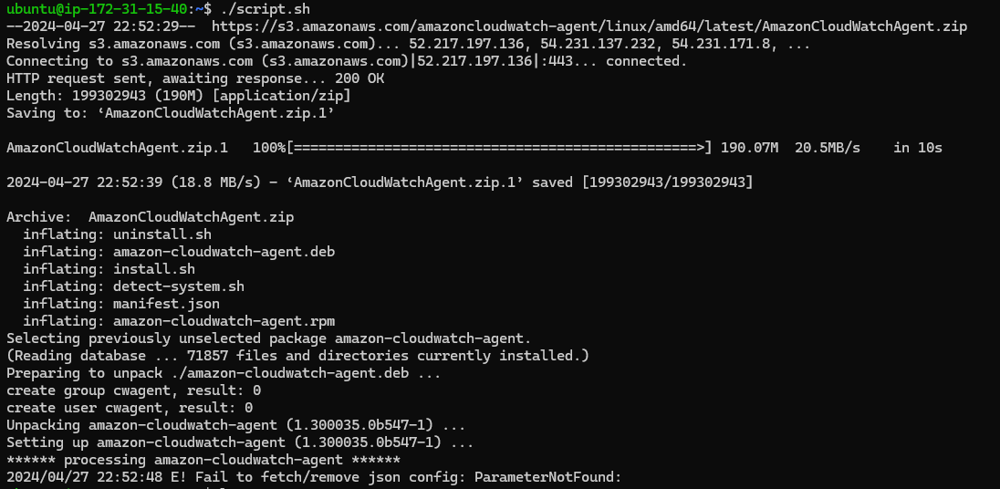
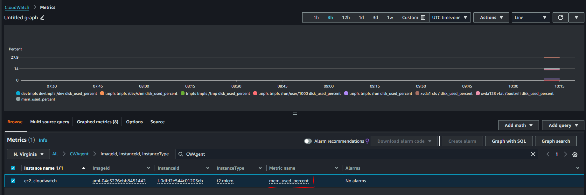

# MONITORING INFRASTRUCTURE IN AWS (Cloudwatch, Cloud trail)

1. Cloudwatch Metrics

Cloud watch metrics are data points representing the behavior of AWS resources and application over
time. These metrics can be collected from various aws services. Metrics provide insights into the
performance, health, and operational status of these resources allowing users to monitor and analyze
their behavior.

 

2. Cloudwatch Alarms

Cloudwatch alarm allows users to define thresholds on cloudwatch metrics and trigger actions when
these thresholds are breached. They are used to proactively monitor the health and performance of
AWS resources and application, enabling users to respond promptly to change in their environment.

### key aspect of clod watch alarm include

- thresholds and Actions: Users can set threshold on cloudwatch metrics, specifying conditions that
  when met or exceeded triggers an alarm state. when an alarm enters an alarm state, users can
  configure actions such as sending notification via AWS SNS, executing lambda functions or
  auto-scaling resources.

- alarm states: cloud watch alarms have three possible states: OK, INSUFFICIENT_DATA and ALARM. The
  okay state indicate that the metrics is within the defined threshold, while the ALARM state
  indicate the threshold has been breached. the insufficient_data state occurs when there is not
  enough data to evaluate the alarm.

- Alarm history: cloud watch maintain a history of alarm state changes, allowing users to track when
  alarm transition between each states and investigate circumstances between each change.

configuration and management: users can create modify and delete alarm through the cloudwatch
management console, AWS CLI, or SDKs. alarms can be managed individually or as part of a large
monitoring configuration such as cloud formation template or AWS auto scaling policies.

### Monitoring AWS EC2 using cloudwatch

1. create an IAM role in AWS
2. Create the role with cloudwatchFullAccess
3. create a parameter in system manager
   - Navigate to aws system manager console
   - navigate to select parameter stores
   - create a new parameters and add the below code

```
{
	"metrics": {
		"append_dimensions": {
			"InstanceId": "${aws:InstanceId}"
		},
		"metrics_collected": {
			"mem": {
				"measurement": [
					"mem_used_percent"
				],
				"metrics_collection_interval": 180
			},
            "disk": {
				"measurement": [
                     "disk_used_percent"
				],
				"metrics_collection_interval": 180
			}
		}
	}
}
```

To explain the details above the image below does justice to it.


### Next let us create an AMAZON LINUX 2 EC2 instance and attache the role we created above in it.

The EC2 instance we will create will have access to the roles which have the SSMFullAccess policy.
But note that SSM will have access to the parameter we created and by attaching the role to the EC2
instance, EC2 will also have access to the parameters.


4. Next we install cloudwatch agent. we will create a file script.sh and paste the below shell
   script

` sudo vi script.sh`

```
#!/bin/bash
wget https://s3.amazonaws.com/amazoncloudwatch-agent/linux/amd64/latest/AmazonCloudWatchAgent.zip
unzip AmazonCloudWatchAgent.zip
sudo ./install.sh
sudo /opt/aws/amazon-cloudwatch-agent/bin/amazon-cloudwatch-agent-ctl -a fetch-config -m ec2 -c ssm:/alarm/AWS-CWAgentLinConfig -s
```

- we make the file executable

` sudo chmod +x script.sh`

- Save and run the file using `esc "wqa!`

` ./script.sh`



5. Start the cloudwatch agent

```
 sudo /opt/aws/amazon-cloudwatch-agent/bin/amazon-cloudwatch-agent-ctl -m ec2 -a start
```


6. verify that cloudwatch is installed and successfully running

```
 sudo /opt/aws/amazon-cloudwatch-agent/bin/amazon-cloudwatch-agent-ctl -m ec2 -a status
```


### Monitoring your metric in cloudwatch

Lets create a new policy and attach it to our IAM role so that the role does not lack permission tp
perform the EC2:Describe Tags, which is necessary for the cloudwatch agent to retrieve EC2 instance
tags.

1. create a new policy:

We will create this policy and paste the below code init

```
{
    "Version": "2012-10-17",
    "Statement": [
        {
            "Effect": "Allow",
            "Action": [
                "ec2:DescribeTags"
            ],
            "Resource": "*"
        }
    ]
}
```

After creating the policy we will add the policy to the role we created initially.


Now let us monitor the metrics by going to cloudwatch console and click on all metrics at the menu
left section.

select the browser tab, search and click on CWAgent

 
 
